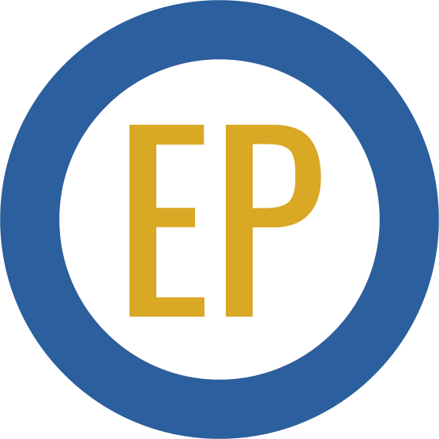

# 💎 Nemium

Este proyecto presenta la estructura de un blog, ¿qué te gustaría postear?

Puedes verlo aquí: [Nemium](https://epontoni.github.io/nemium/)

## 🔍 Vistas 

### 💻 Desktop

### 📱 Mobile

## 📌 Stack

## 🌟 Autor

* **Emanuel Pontoni**  - [@epontoni](https://github.com/epontoni)
